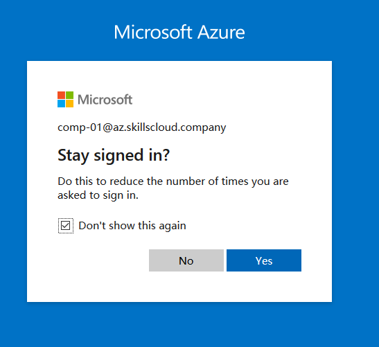

# ITNSA Challenge 2021 
## Module D Familiarization

### Connection instructions
1) Go to https://portal.azure.com and enter your portal credentials

 

2) Choose "No" when you asked to "Stay signed in" to avoid any cookie-related problems when credentials will be rotated next time. Choose whether you want Azure to make a tour across your portal

 

3) Navigate to "Resource groups". Notice that Azure advice small online trainings for each Azure category. Click on "Resource groups"

4) You will see a resource group available for your account (rg-comp-xx). Click on it.
 

5) Now you can see a content of your resource group. To make thing easier to understand you can group items by type to see which components are related to which virtual machine.
 

 
6) Click on comp-xx-cisco-eastus. Here you can see all information about this virtual machine as well as VM-related actions on the top. Click on "Connect" and choose "Bastion".

7) You will see some notification and information regarding Bastion host, click on "Use Bastion".

8) Enter VM credentials and click connect.

9) In case your web browser don't allow pop-up windows, allow pop-up windows for https://*.bastion.azure.com

10) Bastion session will be opened in a new tab by default, and now you can access VM CLI.

11) Notice there is a small double arrow in the middle left of the terminal. If you click on it you can access Bastion clipboard. Here you can paste anything you want to paste to the terminal.

12) Once you are done, close clipboard and make right mouse click to paste contents from clipboard to the terminal

### Mini challenge

To get yourself familiar with Azure environment you can do a couple of simple tasks:

1.	Study this small network topology and make sure that Ubuntu have proper access to the internet via border Cisco VM.
2.	Install Nginx on Ubuntu VM and run a default website. 
3.	Check DNS zone delegated to you. Make Nginx website available via public domain name at https://website.comp-xx.az.skillscloud.company (where xx – is your individual number).

### DISCLAIMER
Azure network system controls all basic networking routines for all virtual machines. All access to virtual machines is managed via in-band connections, so if you will change\release IP address or shutdown any network interfaces, VM will loose its connection to the network and can't be reached anymore. 