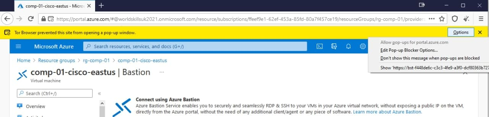
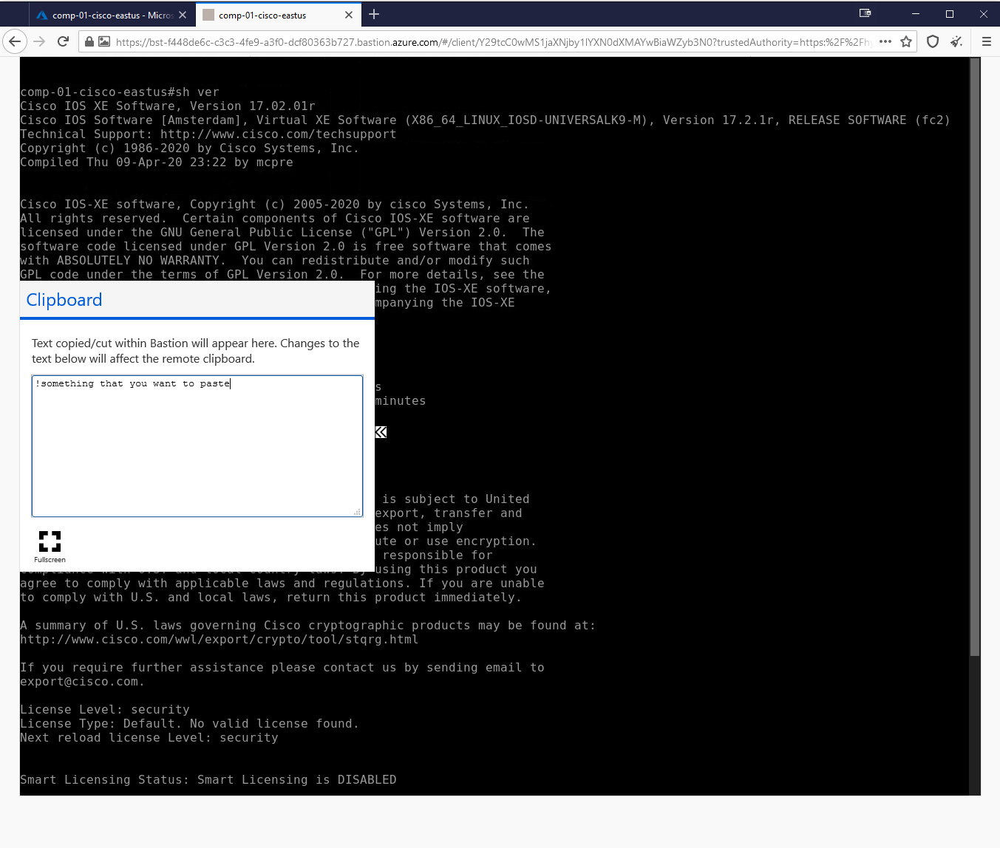
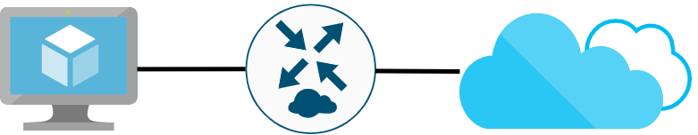

# ОНЧ 2021: Сетевое и системное администрирование
## Руководство по ознакомлению с инфраструктурой

### Инструкции по подключению
1) Перейдите в браузере по адресу https://portal.azure.com и введите вашу учетную запись

 

2) Выберите "Нет", когда система задаст вопрос "Не выходить из системы?" для избежания проблем с cookie при ротации учетных записей между рабочими местами. Обратите внимание, что Azure предлагает первоначальное ознакомление с порталом (опционально).

 

3) Наведите на иконку "Группы ресурсов". Обратите внимание, что Azure предлагает небольшие онлайн-тренинги по работе с каждой категорией ресурсов. Нажмите на "Группы ресурсов"

4) Вы увидите группу ресурсов доступную вашей учетной записи (rg-comp-xx). Нажмите на нее.
 

5) Теперь вы можете видеть ресурсы внутри вашей группы ресурсов. Для удобства рекомендуется сгруппировать ресурсы по типу.
 

 
6) Нажмите на виртуальную машину *comp-xx-cisco-eastus*. В открывшемся блейде вы можете видеть всю информацию всю информацию о виртуальной машине, а также панель действий сверху. Нажмите на "Подключиться" и выберите опцию "Bastion".

7) Вы можете увидеть уведомление и информацию о Бастион-хосте, нажмите на "Использовать бастион".

8) Введите учетные данные виртуальной машины и нажмите "Подключиться".

9) В случае если ваш браузер блокирует всплывающие окна, разрешите всплывающие окна для https://*.bastion.azure.com

10) По умолчанию сессия откроется в новой вкладке и вы получите доступ к интерфейсу коммандной строки виртуальной машины.

11) Обратите внимание на небольшую двойную стрелку слева посередине. Нажмите на нее чтобы открыть окно буфера обмена. В поле текста вы можете вставить любой текст, который вы хотите вставить в интерфейс коммандной строки.

12) После вставки, закройте окно буфера и намите правой клавишей мыши для вставки текста в терминал.

### Тестовое задание

Для более подробного ознакомления со средой Microsoft Azure рекомендуется выполнить несколько простых задач:

1.	Изучите ресурсы внутри вашей группы ресурсов, относящиеся к сетевой подсистеме. Произведите необходимые настройки для того, чтобы машина Ubuntu имела доступ к интернету через пограничный Cisco маршрутизатор.
2.	Установите Nginx на виртуальную машину Ubuntu и запустите веб-сайт по умолчанию. 
3.	Узучите публичную DNS-зону, делегированную вашей группе ресурсов. Произведите необходимые настройки, чтобы ваш веб-сайт был доступен по публичному доменному имени https://website.comp-xx.az.skillscloud.company (где xx – ваш индивидуальный номер).

### Обратите внимание
Сетевая подсистема Azure контролирует все базовые сетевые настройки виртуальных машин в автоматическом режиме. В связи с тем, что управление виртуальными машинами осуществляется внутриполосно (in-band), при попытке смены IP-адресов, запуска DHCP-клиента или выключения сетевых интерфейсов вы потеряете доступ к виртуальной машине.
